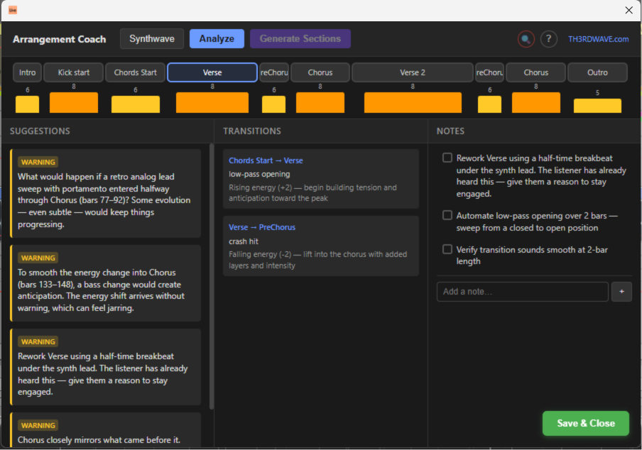
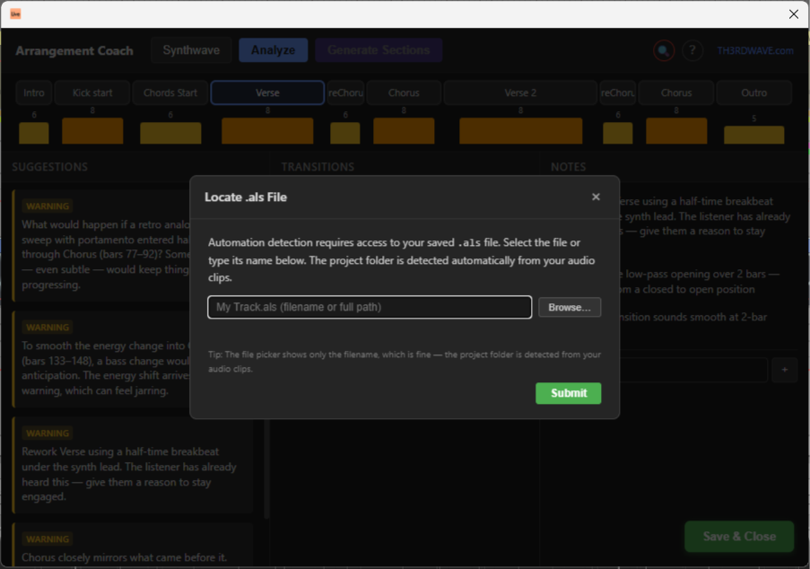

# Arrangement Coach

An Ableton Live Extension that helps electronic music producers transform loops into full arrangements. If you've ever gotten stuck with an 8-bar loop that sounds great but you can't figure out how to build a complete track around it — this is for you.

Arrangement Coach analyzes your Live Set in real time, scores each section's energy level, detects structural problems, recommends transitions, and gives you genre-aware suggestions tailored to your style.

---

## Quick Install

1. Download the [arrangement-coach.ablx](arrangement-coach.ablx) file
2. In Ableton Live, go to **Options → Settings → Extensions**
3. Drag and drop the `.ablx` file into the Extensions settings
4. The extension appears in the **Extensions** panel

---

## How to Use

### 1. Set Up Section Markers

Arrangement Coach uses **Locators** (Ableton's arrangement markers) to define sections. Place locators at the start of each section in your arrangement — Intro, Verse, Build, Drop, Breakdown, Outro, etc.

If you don't have locators yet, click **Generate Sections** in the toolbar to auto-generate genre-appropriate section markers based on either a random structural template (for empty timelines) or content analysis of your existing clips.

### 2. Select Your Genre

Click the genre button in the toolbar to open the genre picker. With 15+ genre families and 120+ subgenres, you can drill down to your exact style. The selected genre adjusts:
- How energy scores are weighted
- What counts as an "issue" (a 64-bar intro is fine for Trance, but too long for Trap)
- Transition recommendations
- Checklist items and suggestions

### 3. Load Your .als File

For full analysis including automation detection (filter sweeps, volume curves, send levels), you need to point the extension at your saved `.als` file.

1. **Save your Live Set** (Ctrl+S / Cmd+S) so automation is written to the file
2. Click the **🔍 button** in the toolbar (it pulses red when not loaded)
3. Click **Browse…** and select your `.als` file
4. Click **Submit** — automation data is parsed and the analysis runs

You only need to do this once per session. If you add or change automation later, save and re-analyze.

### 4. Analyze

Click the **Analyze** button to run the full analysis pipeline. Always save your Live Set first — the extension reads the file on disk, so unsaved changes won't be reflected.

### 5. Work Through Suggestions

Click section pills across the top to navigate between sections. The three panels (Suggestions, Transitions, Notes) update to show context for the active section. Use the auto-generated checklist as a to-do list while arranging.

---

## How the Analysis Works

The analysis pipeline runs in several stages, each feeding into the next:

### Stage 1: Data Extraction

The extension reads your Live Set via the Ableton Extensions SDK:
- **Locators** → section boundaries (name, position, duration)
- **Tracks** → classified by name and device chain into frequency buckets (sub, bass, low-mid, mid, high-mid, high, full)
- **MIDI clips** → note density, velocity, polyphony, pitch range, articulation patterns
- **Audio clips** → spectral analysis (FFT), RMS energy, transient detection, role classification
- **Automation** → parsed from the `.als` file (filter, volume, send, pan envelopes)
- **Devices** → instrument/effect chain analysis for track role classification

### Stage 2: Energy Scoring

Each section receives an energy score from 1–10 based on a weighted combination of factors:

| Factor | What it measures |
|--------|-----------------|
| Active track count | How many tracks have content in this section |
| MIDI density | Notes per bar across all MIDI tracks |
| Track presence ratio | Fraction of total tracks active |
| Automation ratio | Fraction of tracks with automation envelopes |
| Frequency coverage | How many of the 7 frequency buckets are occupied |
| Velocity intensity | Average MIDI velocity (loudness/intensity) |
| Polyphony score | Average simultaneous notes per beat |
| Pitch range | Melodic spread across active tracks |
| Audio energy | Normalized RMS from audio track spectral analysis |
| Synth energy | Contribution from lead/pad/chord/arp synth analysis |

**Genre-adjusted weights** — Different genres emphasize different factors. Techno weights automation and frequency coverage heavily; Hip-Hop weights velocity and MIDI density; Ambient prioritizes pitch range and frequency coverage over track count.

**Relative scoring** — Scores are normalized across your arrangement. The section with the most activity gets a higher score, the least gets a lower score. This means scores represent contrast within *your* track, not an absolute standard.

**Color coding:**
- 🟢 Green (1–3): Low energy — intros, breakdowns, ambient passages
- 🟡 Yellow (4–6): Medium energy — verses, builds, transitions
- 🟠 Orange (7–8): High energy — choruses, drops, peak sections
- 🔴 Red (9–10): Maximum energy — climactic moments

### Stage 3: Issue Detection

The extension scans for structural problems:

| Issue type | What it detects |
|-----------|-----------------|
| Flat energy | Consecutive sections with very similar energy (arrangement feels static) |
| Missing transition | Large energy jump between sections without transition elements (risers, fills, sweeps) |
| Repetition | Consecutive sections with high structural similarity (same tracks, same density, same automation state) |
| Abrupt change | Large energy jumps without genre-appropriate context (no buildup, breakdown, or drop boundary) |
| Frequency crowding | Too many tracks competing in the same frequency bucket |
| DJ compatibility | Intro/outro length, phrase alignment, and mix-zone suitability based on genre expectations |
| Synth repetition | Same synth patterns repeating across multiple sections without variation |
| Low synth density | Synth tracks with very sparse content in a section |
| Harmonic shift | Large harmonic interval jumps without transitional context |
| Duplicated roles | Multiple tracks serving the same instrument role in the same section |

Each issue has a severity level (info, warning, error) and thresholds adjust based on your selected genre.

### Stage 4: Transition Recommendations

For each section boundary, the engine recommends transition techniques based on:
- **Energy delta** — how much the energy changes between sections
- **Boundary type** — whether it's entering a drop, leaving a breakdown, building up, etc.
- **Genre conventions** — what types of transitions are idiomatic for your style
- **Spectral contrast** — how different the audio content is across the boundary

Each recommendation includes:
- Specific techniques (e.g., "16-bar high-pass filter sweep", "2-bar drum fill with snare roll")
- A rationale explaining why this transition type suits the boundary
- A checklist of actionable steps to implement it

### Stage 5: Content-Aware Suggestions

Deep analysis of MIDI and audio content generates targeted suggestions:
- **Pattern fingerprinting** — identifies repeated patterns and suggests where to introduce variation
- **Fill/build detection** — recognizes existing fills and avoids redundant suggestions
- **Instrument role classification** — understands which tracks are kicks, basses, leads, pads, etc.
- **Percussion-specific** — genre-aware drum suggestions (e.g., "add an open hi-hat pattern in the build")
- **Synth variation** — velocity automation, layering, pitch transposition, and articulation ideas
- **Audio frequency balance** — sub-bass presence, spectral density, and frequency distribution
- **Automation opportunities** — where filter sweeps, volume rides, or send automation would add movement

### Stage 6: Reference Comparison (Optional)

Drop a reference track into your Live Set (name it starting with "REF" or "Reference") and the extension will:
- Detect it automatically
- Extract its section structure from clip boundaries
- Compare your arrangement's proportions against the reference
- Show delta indicators for section lengths and timing

---

## What an Ideal Arrangement Looks Like in the UI

A well-structured arrangement displays:

1. **Varied energy bars** — A wave pattern with clear peaks and valleys. Not all the same height.
2. **No red issues** — Zero error-severity issues. A few info/warning items are normal.
3. **Green transition indicators** — Each section boundary has an appropriate transition with a completed checklist.
4. **Genre alignment** — The structural proportions match your genre's conventions (e.g., 32-bar intro for DJ-oriented tracks, 4-bar intro for pop).
5. **Good DJ score** — If making club music, the DJ compatibility scoring shows phrase-aligned intros/outros of appropriate length.

A "problem" arrangement typically shows flat energy bars (all similar height), multiple repetition warnings, and missing transition alerts between major sections.

---

## The Three Panels

### Suggestions (Left)

Arrangement-wide feedback that applies regardless of which section is selected:
- Structural warnings (flat energy, repetition)
- Automation opportunities
- Genre-specific recommendations
- Frequency balance observations
- Synth and percussion suggestions

Each suggestion is color-coded by severity and includes an actionable recommendation — not just "this is wrong" but "here's what to do about it."

### Transitions (Center)

Filtered to the active section. Shows:
- Recommended transition type for entering this section
- Specific techniques with bar durations
- Rationale explaining why this approach fits
- Per-transition checklist items you can tick off as you implement them

### Notes (Right)

Your workspace for each section:
- **User notes** — free-text notes you add manually (persisted per project)
- **Auto-generated checklist** — action items derived from detected issues and suggestions, toggleable as complete
- Notes persist across sessions, keyed to your Live Set file path

---

## Supported Genres

15 genre families with 120+ subgenres:

- **Techno** — Peak Time, Hard, Industrial, Minimal, Acid, Dub, Detroit, Hypnotic, Raw, Schranz, Ghettotech, Hardgroove, Birmingham
- **House** — Deep, Tech, Progressive, Funky, Afro, Jackin, Soulful, UK Garage, Electro, Bass, Chicago, Ghetto, UK Funky, Gqom, French Touch, Lo-Fi, Future Garage
- **Melodic Techno & Progressive** — Melodic Techno, Progressive House, Organic House, Afro House, Indie Dance
- **Trance** — Uplifting, Psytrance, Goa, Progressive, Tech, Vocal, Dark Psy, Forest
- **Drum & Bass** — Liquid, Neurofunk, Jump-Up, Jungle, Classic Jungle, Halftime, Darkside, Minimal, Rollers, Dancefloor, Crossbreed, Atmospheric/Intelligent
- **Dubstep & Bass** — Riddim, Melodic Dubstep, Brostep, Tearout, UK Bass, Future Bass, Colour Bass, Wave
- **Hip-Hop & Trap** — Boom Bap, Trap, Lo-Fi, Phonk, Drill, Cloud Rap, Memphis, Rage, Plugg
- **Pop/Electronic** — Synthpop, Electropop, Future Pop, Hyperpop, Dance Pop, K-Pop
- **Ambient & Downtempo** — Ambient, Chillout, Trip-Hop, Downtempo, IDM, Dub, Lo-Fi House, Film Score
- **Synthwave & Darkwave** — Synthwave, Retrowave, Outrun, Darkwave, Darksynth, Coldwave, Post-Punk, EBM, Witch House
- **Hardcore & Bouncy** — Gabber, Frenchcore, Donk, Breakcore, Hardstyle (Euphoric + Raw), Speedcore
- **Footwork & Juke** — Chicago Footwork, Juke, Teklife-style
- **IDM & Experimental** — IDM, Glitch, Bubblegum Bass / Hyperpop Roots
- **Electro & Breakbeat** — Classic Detroit Electro, Nu-Skool Breakbeat, Electro-Funk
- **African & Latin Electronic** — Amapiano, Afro Tech, Baile Funk

Special parser modes for non-standard genres (IDM, Glitch, Breakcore, Speedcore) disable phrase-based detection to avoid false-positive issues.

---

## Keyboard Shortcuts

| Key | Action |
|-----|--------|
| ← / → | Navigate between sections |
| Enter | Quick-add note |

---

## Requirements

- Ableton Live with Extensions support
- Windows or macOS

---

## Credits

Built by [TH3RDWAVE.com](https://TH3RDWAVE.com)
